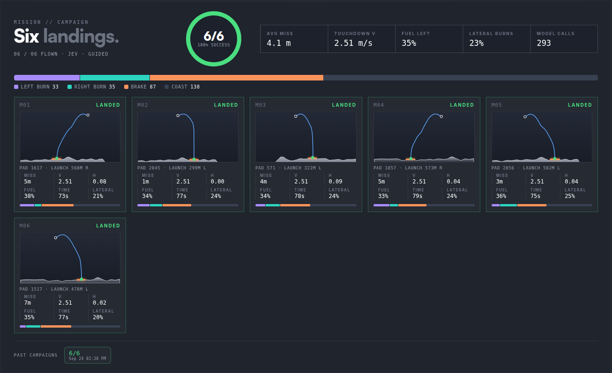
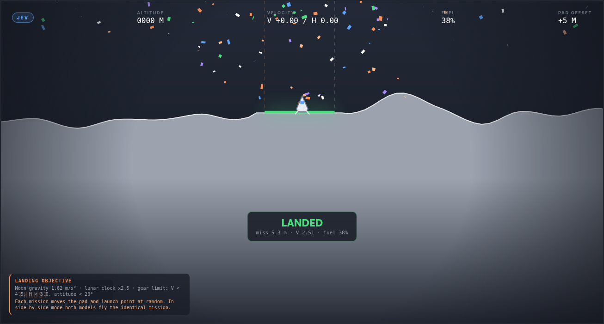
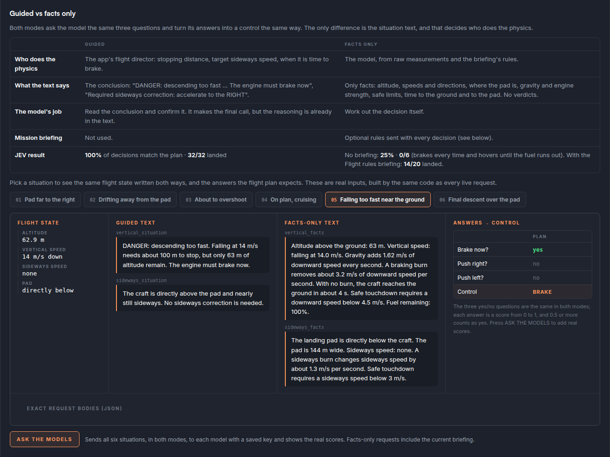

# Wizden Moon Lander

A lunar lander flown by typed-decision models. Every half second of flight, the craft's state goes to a model — [Laya](https://github.com/NandhaKishorM/laya) or JEV — as three yes/no questions, and the answers become the next maneuver. Run batches of missions with random landing zones, fly both models side by side on identical missions, and see exactly what each model was asked and how it answered.

It is also a small, honest experiment in *who does the reasoning*: a **guided** prompt where the app states what the physics requires, versus a **facts-only** prompt where the model has to work it out.



| Soft landing | Guided vs facts only, same flight state |
| --- | --- |
|  |  |

## Quick start

Requires Node.js 18 or later. No dependencies.

```sh
git clone https://github.com/WizdenOrg/wizden-moonlander.git
cd wizden-moonlander
npm start
```

Open <http://localhost:3030>, enter a model's credentials in the top bar, and press **START**.

You need access to at least one model:

- **Laya**: any endpoint that serves Laya's typed-decision API (`POST /v1/decisions`, `X-API-Key` header). The quickest way is [`laya-service/colab_laya_service.py`](laya-service/colab_laya_service.py): run it in a Google Colab T4 runtime, and it prints a temporary public URL and an API token to paste into the top bar.
- **JEV**: a Typesafe API key (`https://api.typesafe.ai/v1/systemone`, model `jev-latest`).

Keys are stored in your browser only. Each decision goes to this app's own relay (`/api/lander/decide`), which calls the model and strips the key from its response. The relay is needed because JEV's API does not accept calls straight from a browser (CORS). The pilot buttons show only the models whose connection is filled in, and **SIDE BY SIDE** appears when both are.

## What you can do

- **Campaigns**: fly 1–100 missions back to back. Each mission has a random pad and a launch point 150–600 m from it. The board shows a success ring, averages, the action mix, and one card per mission with the flight path over that mission's terrain. Results persist in the browser, and finished campaigns are archived.
- **Side by side**: Laya and JEV fly the identical mission in two panes, and the board compares them.
- **Speed**: 1× to MAX. Above 1× the simulation waits for each answer, then fast-forwards, so results do not depend on speed. Playback is decoupled and interpolated, so it stays smooth. The real speed is capped by model latency.
- **Prompt mode**: guided or facts only (see below), fixed per campaign and recorded with its results.
- **Mission briefing** (facts only): optional rules sent with every decision, with clickable examples and their measured results.
- **Tech specification**: a collapsible section at the bottom with the real inputs for six example situations in both modes. It includes the exact request bodies, a button that asks the models live, the flight rules, and measured results.
- **Outcomes**: a soft landing on the pad counts as success (confetti). A soft landing elsewhere is an intact off-pad landing, which does not count. Anything harder is a crash (explosion).
- **Manual mode**: switch off the autopilot and fly it yourself (W/Space thrust, A/D yaw).

## How a decision is made

1. The browser simulates the flight (`public/lander-physics.js`) and takes a snapshot every 480 ms of flight time.
2. The relay validates the snapshot and builds the request (`public/lander-adapter.js`, shared with the page's tech specification).
3. The snapshot becomes two short texts, vertical and sideways, and three yes/no questions: *brake now? push right? push left?*
4. The model scores each question from 0 to 1. Braking wins at ≥ 0.5; otherwise the stronger sideways answer at ≥ 0.5; otherwise coast.
5. The craft flies that maneuver until the next answer. Maneuvers use attitude hold, as in a real lander. Translation burns tilt to ±0.5 rad. The brake throttles down near 2.5 m/s, so it cannot climb, and it leans slightly against sideways drift.

Both models receive byte-identical state and questions; only the endpoint, auth header and model name differ.

## Guided vs facts only

| | Guided | Facts only |
| --- | --- | --- |
| Who does the physics | The app's flight director (`public/lander-guidance.js`): stopping distance, target sideways speed, when to brake | The model, from measurements and the briefing's rules |
| Example text | "DANGER: descending too fast. Falling at 14 m/s needs about 100 m to stop, but only 63 m of altitude remain. The engine must brake now." | "Altitude above the ground: 63 m. Vertical speed: falling at 14.0 m/s. Gravity adds 1.62 m/s … A braking burn removes about 3.2 m/s … Safe touchdown requires a downward speed below 4.5 m/s." |
| The model's job | Confirm the stated conclusion | Work out the decision |

Measured on 2026-09-24 with `scripts/benchmark.js`: both models, the same 160 labelled flight states (decisions) and the same 32 flights (16 missions × 150/300 ms reaction delay). Laya 0.3.5 `english` on a Colab T4 GPU; JEV `jev-1.13.0`. Full summary: [`benchmarks/results/2026-09-24-gpu/summary.md`](benchmarks/results/2026-09-24-gpu/summary.md).

| Prompt | Laya decisions | Laya landings | JEV decisions | JEV landings |
| --- | --- | --- | --- | --- |
| Raw telemetry numbers, one 4-way choice | 25.0% | 0/32 | 31.9% | 0/32 |
| Guided, one 4-way choice | 68.8% | 0/32 | 100% | 32/32 |
| Guided, three yes/no (default) | 100% | 32/32 | 100% | 32/32 |
| Computed numbers + rule, no verdict | 20.6% | 0/32 | 80.0% | 32/32 |
| Facts only, no briefing | 25.0% | 0/32 | 25.0% | 0/32 |
| Facts only + "Flight rules" briefing | 25.0% | 0/32 | 53.1% | 22/32 |

With raw numbers, both models pick one direction for almost every state. Guided, both fly identically. In facts-only mode both brake in every state and hover until the fuel runs out. JEV follows lookup-table briefings ("falling 20 m/s: brake below 220 m") and can compare numbers it is given; Laya only acts on stated conclusions and ignores briefings.

## Tests and evaluation

```sh
npm test                                                   # offline: physics, guidance, request contract, relay, closed-loop flights vs a fake model
LAYA_URL=... LAYA_TOKEN=... JEV_KEY=... npm run test:live   # live acceptance per configured model (others are skipped)
JEV_KEY=... npm run eval:lander -- --provider jev --variants binary,facts --random 10
```

For the full comparison, put `LAYA_URL`, `LAYA_TOKEN` and `JEV_KEY` in a file and run `node scripts/benchmark.js --env path/to/file.env` (all prompt cases, both models, about 30 minutes; `--providers`, `--cases`, `--per-label`, `--random`, `--seed` narrow it). It writes every call (exact state sent, raw scores, timing, model version) and a `summary.md` to `benchmarks/results/<run>/`. Credentials are never written. Raw call logs are git-ignored; summaries are committed.

`scripts/lander-eval.js` flies the headless simulator (`src/lander-sim.js`) against a live model. It reports per-decision accuracy (confusion matrix, per-reason hit rate) and closed-loop landings, and saves JSON reports to `eval-results/`. Options include `--provider laya|jev`, `--variants`, `--briefing "..."`, `--random N --seed S`, `--latency 150,300`, and `--probes-only` / `--flights-only`.

## Project layout

```
public/            the browser app, plus modules shared with Node:
                   lander-physics.js (flight model), lander-guidance.js (flight director),
                   lander-adapter.js (requests, providers, answer parsing), lander-spec.js (tech spec)
src/relay.js       decision relay: validation, origin check, rate limit, endpoint guard, key redaction
src/lander-sim.js  headless simulator for tests and evaluation
server.js          local server: static files + relay
api/lander/        the relay as a Vercel function (decide.js)
scripts/           live evaluation and the full benchmark
benchmarks/        benchmark results (summaries)
test/              offline suite and live acceptance suite
laya-service/      Colab script that serves Laya with a temporary public URL
```

## Deploy to Vercel

Import the repository in Vercel: no build step or settings are needed. `vercel.json` serves `public/` as static files and deploys `api/lander/decide.js` as a function (30 s limit), with the same security headers as the local server.

Each decision is one short function call: about 500 per 10-mission campaign, a few milliseconds of CPU each, the rest spent waiting on the model. The tech specification is built in the browser and needs no function call.

On Vercel the relay is public, so it protects itself:

| Protection | Default | Setting |
| --- | --- | --- |
| Only its own page may call it (Origin/Referer must match the deployment host) | on | `RELAY_ALLOWED_ORIGINS`: extra origins, comma-separated |
| Rate limit per client IP, per function instance (best effort) | 300 decisions/min | `RELAY_RATE_LIMIT` (0 = off); for a hard limit, add a Vercel Firewall rate-limit rule on `/api/lander/decide` |
| Laya endpoint must be `https` and resolve to a public address | on | `LAYA_ALLOWED_HOSTS`, e.g. `*.trycloudflare.com` |
| Model call timeout, below the function limit | 25 s | `PROVIDER_TIMEOUT_MS` |
| JEV endpoint is fixed; request bodies are capped at 100 kB | on | none |

## Security notes

- The local server listens on `127.0.0.1` by default. The relay forwards requests to whatever Laya endpoint the page supplies, so only set `HOST=0.0.0.0` on a trusted network, and then also set `RELAY_PUBLIC=1` to turn on the same protections as on Vercel.
- API keys live in the browser's local storage. Use a private profile on shared machines, and **FORGET** in the top bar clears them.
- The Colab service generates a fresh API token each run; its tunnel URL is public while the cell runs.

## Configuration

See [`.env.example`](.env.example): `PORT` (default 3030), `HOST` (default 127.0.0.1), and the relay settings above. Model credentials are entered in the page, not in environment variables. The environment variables are used only by the command-line tests and evaluation.

## License

[MIT](LICENSE) © 2026 Wizden. Laya and JEV are separate projects with their own terms.
